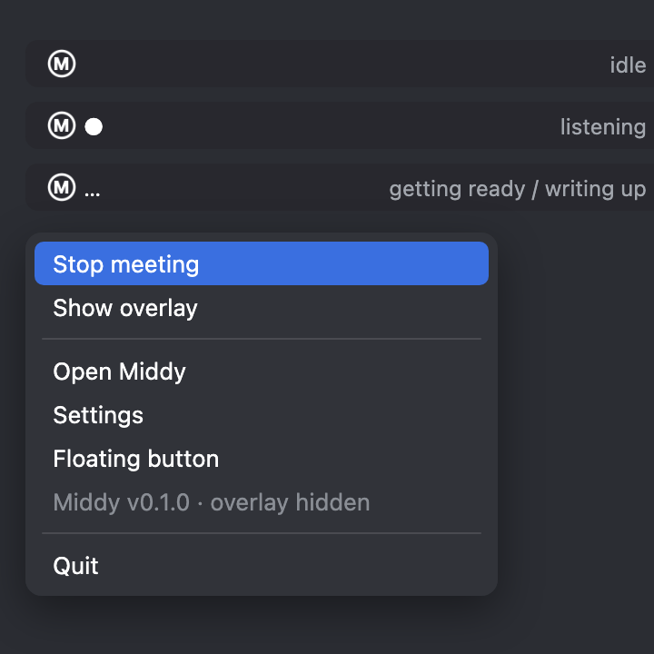
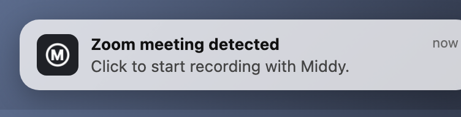
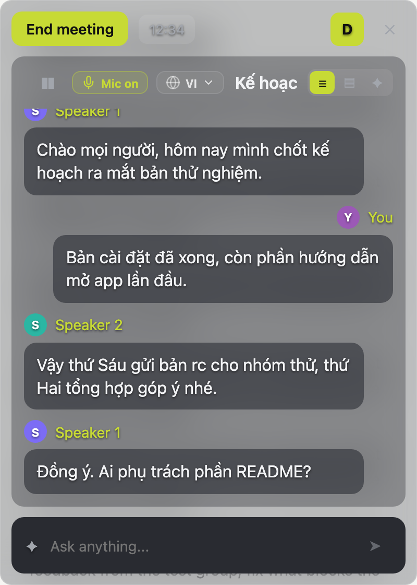
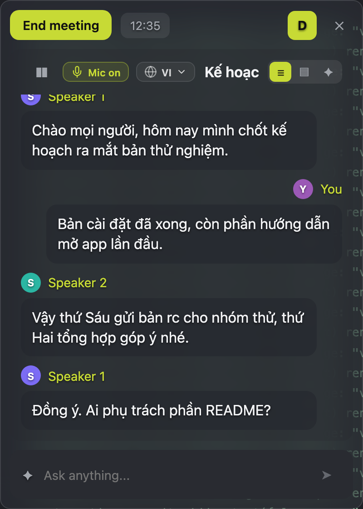
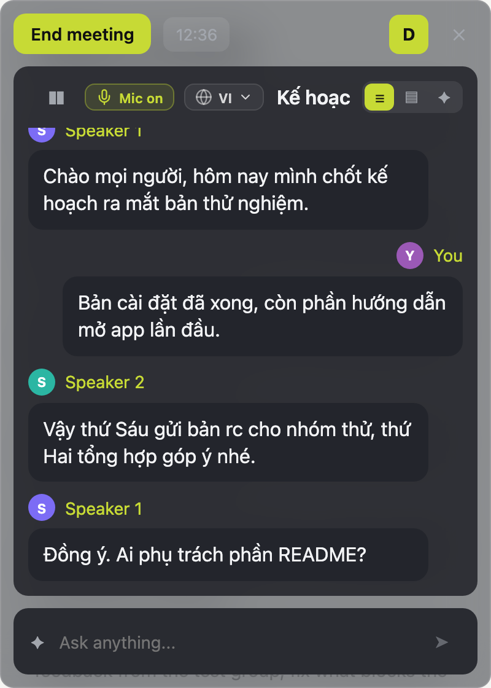
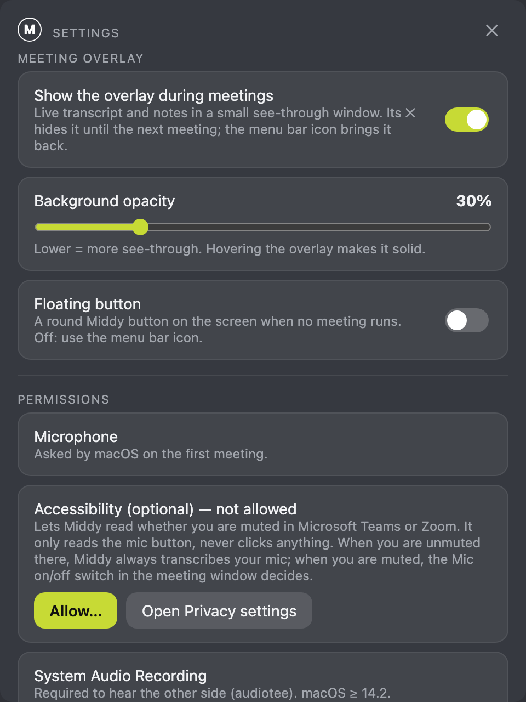

# Middy

[](https://github.com/trongnguyenbinh/middy/actions/workflows/ci.yml)

Local meeting notes for macOS. Middy records your meeting (microphone + the audio of the meeting app), transcribes it,
labels speakers, keeps light live notes and writes a Minutes of Meeting (MoM). The app runs inside a macOS sandbox profile
with network sockets blocked (`proto/nonet.sb`), and Record stays disabled until a self-test confirms the network is blocked.

- Speech-to-text: Qwen3-ASR 1.7B (MLX), streaming + a refining second pass, Silero VAD
- Speakers: online labels from 3D-Speaker CAM++ embeddings, then pyannote segmentation 3.0 per 10-minute chunk and over the
  whole meeting (sherpa-onnx). The chunk step reuses the CAM++ embeddings the recogniser already computed.
- Live notes during the meeting: a light extract of the transcript (sentences with a number, a question, a decision or a
  task), refreshed at most every 2 minutes (`MIDY_LIVE_EVERY_S`). No language model runs while you record.
- MoM, "Ask anything" and the Word export: one of two summarizers (Settings → **Minutes by Claude Code**):
  - **Local** (default): Gemma 4 E4B, 8-bit MLX (mlx-lm), loaded only when needed: the MoM after Stop, a question asked in
    the meeting overlay (then released after 5 idle minutes, `MIDY_LLM_IDLE_S`), a Word export (its own short-lived worker).
    Nothing leaves the Mac.
  - **Claude Code**: Gemma is never loaded. Claude Code reads the meeting through Middy's MCP server and writes the minutes
    back (see [Claude Code (MCP)](#claude-code-mcp)). "Ask anything" in the overlay points you to Claude Code.
- Desktop shell: Electron (toolbar, meeting overlay, library); backend: a Python daemon over a Unix socket
- Export: Markdown, and a Word MoM filled into `templates/mom_template.docx` (use your own template with `MIDY_MOM_TEMPLATE`)

> Status: early, source-only. There is no prebuilt app; run it from source as below. This repository is a fork of
> [harleyb283/middy](https://github.com/harleyb283/middy) (MIT).

## Requirements

- Apple Silicon Mac, macOS 14.2 or later (system audio via Core Audio taps, through [audiotee](https://github.com/makeusabrew/audiotee), MIT)
- Python 3.12, Node.js with npm, Xcode command line tools (`swiftc`, `swift`)
- About 13 GB of disk for the models (Gemma 8.4 GB, Qwen3-ASR 4.4 GB); about 4.5 GB without Gemma if you only use the
  Claude Code summarizer
- Memory: 16 GB is enough for the Claude Code summarizer; 24 GB recommended for the local one (see [Memory](#memory))

## Install

The packaged-app paths assume the checkout lives at `~/middy`; set `MIDY_ROOT` to use another place.

```sh
git clone https://github.com/trongnguyenbinh/middy ~/middy && cd ~/middy

# Python backend
python3.12 -m venv .venv
.venv/bin/pip install -r requirements.txt

# Swift helpers
swiftc -O -o tools/audiocap tools/audiocap.swift -framework CoreAudio -framework AVFoundation
swiftc -O -o tools/ocr tools/ocr.swift
git clone https://github.com/makeusabrew/audiotee tools/audiotee-src
(cd tools/audiotee-src && git checkout 56ac954 && swift build -c release)

# Electron app
cd app && npm install && npm run build && npm run probe
```

## Models

Models are **not** in this repository; download them yourself from the official sources below. None of them is gated
(no Hugging Face login or token needed). The app runs offline (`HF_HUB_OFFLINE=1`), so download everything **before**
the first start. It does not download anything on its own.

| Model | Source | Put it at |
|---|---|---|
| Qwen3-ASR 1.7B (Apache-2.0) | [huggingface.co/Qwen/Qwen3-ASR-1.7B](https://huggingface.co/Qwen/Qwen3-ASR-1.7B) | Hugging Face cache under `models/hf` (or `MIDY_HF_HOME`) |
| Gemma 4 E4B instruct, MLX 8-bit (Apache-2.0) | [huggingface.co/lmstudio-community/gemma-4-E4B-it-MLX-8bit](https://huggingface.co/lmstudio-community/gemma-4-E4B-it-MLX-8bit) | `models/gemma-4-E4B-it-MLX-8bit/` |
| pyannote segmentation 3.0 (ONNX, sherpa-onnx) | [k2-fsa/sherpa-onnx releases](https://github.com/k2-fsa/sherpa-onnx/releases/tag/speaker-segmentation-models) | `models/sherpa-onnx-pyannote-segmentation-3-0/model.onnx` |
| 3D-Speaker CAM++ speaker embedding | [k2-fsa/sherpa-onnx releases](https://github.com/k2-fsa/sherpa-onnx/releases/tag/speaker-recongition-models) | `models/3dspeaker_speech_campplus_sv_en_voxceleb_16k.onnx` |
| Silero VAD v6 (MIT, as shipped by faster-whisper 1.2.1) | [SYSTRAN/faster-whisper](https://github.com/SYSTRAN/faster-whisper/tree/v1.2.1/faster_whisper/assets) | `models/silero_vad_v6.onnx` |

```sh
cd ~/middy && mkdir -p models
HF_HOME=models/hf .venv/bin/hf download Qwen/Qwen3-ASR-1.7B
.venv/bin/hf download lmstudio-community/gemma-4-E4B-it-MLX-8bit --local-dir models/gemma-4-E4B-it-MLX-8bit   # skip for Claude Code only
curl -L https://github.com/k2-fsa/sherpa-onnx/releases/download/speaker-segmentation-models/sherpa-onnx-pyannote-segmentation-3-0.tar.bz2 | tar -xj -C models
curl -L -o models/3dspeaker_speech_campplus_sv_en_voxceleb_16k.onnx https://github.com/k2-fsa/sherpa-onnx/releases/download/speaker-recongition-models/3dspeaker_speech_campplus_sv_en_voxceleb_16k.onnx
curl -L -o models/silero_vad_v6.onnx https://github.com/SYSTRAN/faster-whisper/raw/v1.2.1/faster_whisper/assets/silero_vad_v6.onnx
```

Each model keeps its own license; check them on the pages above before use.

## Run

```sh
cd ~/middy/app && npx electron .
```

macOS asks for Microphone and System Audio Recording permission on the first meeting. Accessibility is optional (lets
Middy follow the mute state of your meeting app). Meetings, transcripts and notes are stored in `run/` (SQLite), never
uploaded. Global shortcut to start/stop: ⌃⌥R (changeable in Settings). The summarizer (Local / Claude Code) is chosen in
Settings and applies to the next meeting and to Word exports.

## Using Middy

Middy stays out of the way: no window and no floating button while no meeting runs. Everything starts from the **menu bar
icon**.

| Menu bar (mock-up) | Meeting detected (mock-up) |
|---|---|
|  |  |

- **Menu bar icon.** The icon alone = idle; **●** = listening; **❚❚** = paused; **…** = getting ready or still writing up the
  last meeting. Its menu: Start / Stop meeting, Show overlay (when you hid it), Open Middy (library), Settings, Floating
  button, Quit. ⌃⌥R starts and stops a meeting from anywhere.
- **Meeting detected.** When a desktop meeting app (Zoom, Microsoft Teams, Webex, Slack, FaceTime, ...; not calls in a
  browser) takes the microphone, Middy shows one small macOS notification. Click it to start recording; ignore it and it goes away (that app is not announced again until its call
  ends). It never covers the screen and never starts on its own. macOS asks once whether
  Middy may show notifications; if you say no, use the menu bar or ⌃⌥R.
- **Meeting overlay.** A small see-through window with the live transcript, the light notes and Ask. It is frosted and mostly
  transparent so it can sit over your slides; hover it and it turns solid to read or click. Drag it by its top bar: Middy
  remembers where. **✕** hides it for the rest of the meeting (the recording goes on); Show overlay in the menu bar brings it
  back, and the next meeting opens it again. It closes when the meeting ends.

| Overlay over a light page | Over a dark page | Hovered |
|---|---|---|
|  |  |  |

- **Settings → Meeting overlay.** Show the overlay during meetings (on/off), background opacity (10–100 %, default 30 %), and
  the old floating button for those who want it (off by default).



The screenshots are rendered headless from the app's real renderer with sample data (`app/tools/ux_shots.js`; no window is
opened). The native frosted background of the overlay and settings windows is approximated there; the menu bar and the
notification are native macOS UI and are shown as mock-ups.

## Claude Code (MCP)

With **Settings → Minutes by Claude Code** on, Middy records, transcribes and labels speakers, and Claude Code writes the
minutes. Claude Code reads the meeting through a small MCP server: a separate stdio process (`claude_mcp/mcp_server.py`,
official `mcp` SDK 2.3, its own venv) that talks **only** to the running daemon over its Unix socket (`run/midy.sock` of
the same checkout, or `MIDY_SOCKET`). It opens no network port and loads no model. The Middy app must be running.

```sh
cd ~/middy && python3.12 -m venv .venv-mcp && .venv-mcp/bin/pip install -r claude_mcp/requirements.txt
claude mcp add --scope user middy -- ~/middy/.venv-mcp/bin/python ~/middy/claude_mcp/mcp_server.py
```

| Tool | Access | What it does |
|---|---|---|
| `list_meetings` | read | Meetings, newest first: id, name, status, start, duration, space, language |
| `get_meeting` | read | One meeting: details, speakers, segment count, which notes exist (no transcript text) |
| `get_transcript` | read | Lines `[hh:mm:ss] Speaker: text`, paged with `offset` / `limit` (max 1000); follow `next_offset` |
| `search` | read | Full-text search over every transcript; hits with meeting, time, speaker, snippet |
| `get_minutes` | read | The user's edited note, else the MoM (local or Claude), else the live notes |
| `get_glossary` | read | Term glossary of a space |
| `save_minutes` | **write** | Stores Claude's Markdown minutes as the meeting's MoM (shown in the app; replaces the current MoM), with an optional form for the Word template (title, objective, highlights, actions, ...) |
| `export_docx` | **write** | Writes the Word MoM from that form, without Gemma; only inside `~/Documents` (default `~/Documents/Middy/<name> - MoM.docx`), never over an existing file unless `overwrite` is true |

A refusal (app not running, path outside `~/Documents`, file exists, unknown meeting) comes back to Claude with its reason.

**Privacy.** The app, the daemon and every worker stay in the no-network sandbox in both modes. The MCP server runs
**outside** it, because Claude Code starts it. Meeting text leaves the Mac only when a tool is called (by you, or by Claude
Code on your behalf); it then goes to Claude like anything else in that session. For a meeting that must stay on the Mac,
use the Local summarizer, or do not register the server.

## Memory

Measured on an Apple Silicon Mac (24 GB), Claude Code summarizer, headless daemon (no UI), a 306 s Vietnamese two-voice
recording played in real time, every Middy process sampled every 0.2 s. `ps` RSS misses the Metal memory MLX uses, so the
table gives `phys_footprint` (`proc_pid_rusage`) as well. Gemma was not downloaded: its rows are **estimates** from the size
of its weights, not measurements.

| | RSS | phys_footprint | Kind |
|---|---|---|---|
| ASR worker of the meeting (Qwen3-ASR 1.7B + VAD + CAM++) | up to 4.1 GB | ~4.2 GB steady | measured |
| Spare warm ASR worker (the pool reloads one 30 s after a meeting starts, ready for the next meeting) | ~0.1-0.2 GB | ~4.1 GB steady, ~8 GB while loading | measured |
| Chunk diarization process (pyannote + CAM++, a few seconds every 10 min) | 223 MB peak (282 MB before CAM++ reuse) | 196 MB peak (258 MB before) | measured |
| Whole-meeting diarization after Stop | 280 MB peak | 257 MB peak | measured |
| Daemon `midyd.py` | < 100 MB | < 100 MB | measured |
| **All Middy processes during a meeting, Claude Code summarizer** | | **~8.5 GB steady, 12.2 GB peak** | measured |
| Gemma 4 E4B 8-bit worker (Local summarizer, after Stop or for a question) | | ~8.4 GB + context | estimate |
| Local summarizer, MoM being written | | ~8.5 GB + ~8.4 GB | estimate |

Hence 16 GB for the Claude Code summarizer and 24 GB for the Local one. Before this version a warm Gemma was also kept loaded
from launch and a second one was loaded during each meeting (estimate: ~2 × 8.4 GB more while recording).

## Layout

```
app/      Electron shell: main process (windows, tray, audio, network guard), renderer (React), Swift helpers in app/tools
claude_mcp/ MCP server for Claude Code (stdio, talks to the daemon socket only)
proto/    Python daemon midyd.py: ASR / LLM workers, diarization, notes, MoM, Word export, SQLite store; *_test.py checks
tools/    Swift capture/OCR helpers and measurement scripts
templates mom_template.docx (neutral Word MoM frame)
```

Code comments sometimes refer to internal issue numbers (Lỗi / Việc N) and are partly in Vietnamese.

## Checks

No model, no audio device and no network are needed for these. CI (`.github/workflows/ci.yml`) runs them on every push
to `main` and every pull request: Python and Electron on Linux, then a macOS job that type-checks the Swift helpers and
checks that `nonet.sb` blocks TCP and DNS.

```sh
python3.12 -m venv .venv && .venv/bin/pip install -r requirements-dev.txt -r claude_mcp/requirements.txt
.venv/bin/ruff check proto tools tests claude_mcp
.venv/bin/python -m pytest       # unit tests incl. the MCP tools against the daemon's request handling; -m model runs the model-backed checks
cd app && npm ci && npm run lint && npm test && npm run build
```

## License

MIT. See [LICENSE](LICENSE). Third-party models and libraries keep their own licenses.
